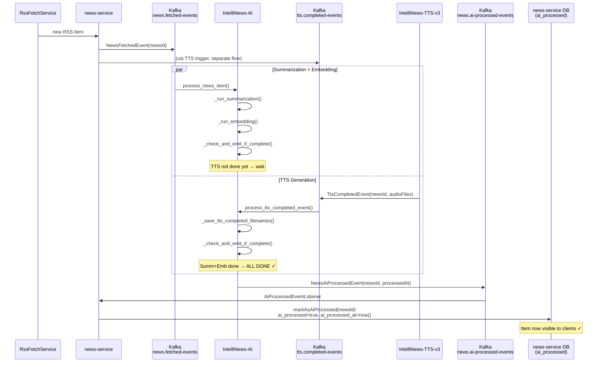

# AI-Processed Event Flow

## Problem

A news item needs **three independent AI tasks** to be complete before it becomes
visible to clients (`ai_processed = true`):

| Task | Triggered by | Service |
|---|---|---|
| Summarization | `news.fetched-events` | IntelliNews-AI |
| Embedding | `news.fetched-events` | IntelliNews-AI |
| TTS audio | `tts.completed-events` | IntelliNews-AI (from TTS-v3) |

TTS finishes asynchronously and independently — it can arrive **before or after**
summarization + embedding. The news-service must only mark a news item as ready
when **all three** are done.

---

## Solution: Completion Gate Pattern

After **each** task path finishes, IntelliNews-AI reads the DB to check whether
the other path is already done. If both sides are complete it emits a single
`news.ai-processed-events` Kafka message. The news-service consumes this and
flips `ai_processed = true`.



> [!NOTE]
> The gate is **idempotent by design**: `_check_and_emit_if_complete` only checks
> state — it never modifies it. If both paths happen to call it simultaneously
> (race), two events may be emitted, but `markAsAiProcessed` is idempotent
> (it just sets the same boolean again).

---

## Is this doing "double DB checks"?

Yes — **by design this pattern performs an extra DB read after each task path**.

- **Why it feels like “twice”**: summarization+embedding finishes and calls `_check_and_emit_if_complete()` (DB read). Later TTS finishes and calls `_check_and_emit_if_complete()` again (another DB read). Depending on ordering, you’ll usually do **2 reads per newsId** (sometimes more if retries / duplicates happen).
- **It’s correct**: given the current design (AI service is the aggregator and the DB is the shared state), the second read is the mechanism that discovers “the other task(s) are now done”.
- **When it becomes wasteful**: as throughput grows, these “gate reads” become a non-trivial share of DB load because they happen regardless of whether the final condition is satisfied.

---

## More effective alternatives (no implementation yet)

Below are options that reduce DB reads and/or make the “all tasks complete” decision more reliable.

### Option A — Atomic “gate on write” (single DB round-trip per task)

Instead of **write → read → decide**, make each task completion do **write → attempt gate** in the DB using an atomic update that only succeeds when all prerequisites are present.

- **Idea**: whenever a task finishes, persist its result as usual, then run a single conditional statement like “set `ai_processed=true` (or emit-outbox row) **only if** summary+embedding+tts are all present and it’s not already processed”.
- **Effect**: eliminates the “check DB twice” read pattern; you still have DB work, but it’s **one conditional operation** per completion rather than “always read, sometimes emit”.
- **Important**: keep the gate idempotent by using a guard condition (e.g., `ai_processed=false`) or a unique constraint for an outbox record.

This is often the simplest improvement if you want to keep the aggregation decision where it is today.

### Option B — Emit per-task events; let `news-service` aggregate readiness

Move the “completion gate” from IntelliNews-AI to `news-service`:

- IntelliNews-AI emits **three independent events** (or two, depending on your design):
  - `news.summary-completed`
  - `news.embedding-completed`
  - `news.tts-completed`
- `news-service` stores 3 booleans/timestamps for each `newsId` and flips `ai_processed=true` when it sees all three.

Why this is more effective:

- **No cross-service DB reads from IntelliNews-AI**: AI doesn’t need to read the news-service DB to know what TTS did; it just emits what it knows.
- **Single source of truth**: `news-service` owns the “visibility” rule and the readiness state.
- **Cleaner failure handling**: if AI crashes after producing summary, the emitted event is the record; `news-service` can still advance state.

Trade-offs:

- Requires `news-service` schema/state to track partial completion.
- More topics/events, but they are simple and naturally idempotent if keyed by `(newsId, taskType)` with de-dupe.

If your main concern is “why are we checking the database twice”, this option removes that pattern entirely.

### Option C — Stream/table aggregation (Kafka Streams / ksqlDB style)

Model each task completion as an event stream and create a **materialized table** keyed by `newsId` that merges task states. When all three fields are present, emit `news.ai-processed-events`.

- **Effect**: the “check” becomes an in-stream join/merge rather than DB reads.
- **Benefits**: naturally handles out-of-order events; can compact state; scales well.
- **Trade-offs**: operational complexity (running streams app), more moving parts than Options A/B.

### Option D — Cache/Redis as the gate state (reduce DB reads)

If you want to keep AI as the aggregator but reduce DB traffic:

- Track task completion flags in Redis (or another low-latency store) keyed by `newsId`.
- On each completion, update the cache and check if all flags are set; only then do a DB write/emit.

Trade-offs:

- Adds infrastructure and consistency considerations (cache loss, TTL, recovery).
- You still need a recovery mechanism (periodic reconciliation) unless you also persist flags durably somewhere.

### Option E — Outbox pattern for “exactly-once-ish” emission

Regardless of where the gate lives, the hardest real-world failure mode is:

> Task completion is stored, but the process crashes before publishing the Kafka event.

Using an **outbox** (in the same DB transaction as the state change) makes publishing robust:

- Write “ready” state + outbox row atomically.
- A background publisher drains the outbox to Kafka.

This does not directly reduce reads, but it **increases correctness** and often simplifies retries/reconciliation.

---

## Recommendation (pragmatic)

- **If you want minimal change to the current mental model**: pick **Option A (atomic gate on write)** + consider **Option E (outbox)** later for resilience.
- **If you want the cleanest architecture and least cross-service coupling**: pick **Option B (per-task events, `news-service` aggregates)**.

Both options eliminate the need for IntelliNews-AI to “check the database twice” to decide readiness; they just do it in different places (DB atomics vs event-driven aggregation).

---

## Completion Conditions (checked in DB)

```python
# services/ai_processor_service.py — _check_and_emit_if_complete()
summarization_done = ai_result is not None and ai_result.summary_short is not None
embedding_done     = embedding is not None          # NewsEmbedding row exists
tts_done           = (ai_result is not None
                      and isinstance(ai_result.audio_files, list)
                      and len(ai_result.audio_files) > 0)

if summarization_done and embedding_done and tts_done:
    _emit_ai_processed(news_id)
```

---

## Kafka Message Contract

**Topic:** `news.ai-processed-events`  
**Key:** `str(newsId)`  
**Payload (JSON):**

```json
{
  "newsId": 1295,
  "processedAt": "2026-05-11T14:05:00.123456+00:00"
}
```

> [!IMPORTANT]
> `processedAt` is an **ISO-8601 UTC string** (not epoch-ms).
> Spring Boot's `JavaTimeModule` deserializes it directly into `java.time.Instant`.

---

## Files Changed

### `commons` module

| File | Change |
|---|---|
| `KafkaTopics.java` | Added `TOPIC_AI_PROCESSED = "news.ai-processed-events"` |
| `NewsAiProcessedEvent.java` | **New** — `record(Long newsId, Instant processedAt)` |

### `news-service`

| File | Change |
|---|---|
| `KafkaConfig.java` | Replaced with full version: topic bean + typed `ConsumerFactory` + `ConcurrentKafkaListenerContainerFactory` |
| `messaging/AiProcessedEventListener.java` | **New** — `@KafkaListener` on `TOPIC_AI_PROCESSED`, calls `newsService.markAsAiProcessed()` |
| `resources/application.yaml` | Added `spring.kafka.consumer` block with `JsonDeserializer` config |

### `IntelliNews-AI` (Python)

| File | Change |
|---|---|
| `config/settings.py` | Added `kafka_topic_ai_processed: str` |
| `services/kafka_producer_service.py` | **New** — `KafkaProducerService` with `publish_ai_processed()` |
| `services/ai_processor_service.py` | Added `_check_and_emit_if_complete()` gate, called after both `process_news_item` and `process_tts_completed_event` |

---

## Edge Cases

| Scenario | Behaviour |
|---|---|
| TTS arrives **before** summarization/embedding finishes | Gate fires after summarization/embedding path — TTS done flag already true in DB |
| Summarization/embedding finish **before** TTS | Gate fires after TTS path — summary_short already set in DB |
| TTS event lost / never arrives | Item stays hidden. A scheduled retry job (future work) could re-check stale items |
| Summarization fails | `summary_short` stays null → gate never passes → item stays hidden |
| Embedding fails | `NewsEmbedding` row absent → gate never passes → item stays hidden |

> [!TIP]
> For production resilience, add a scheduled job in IntelliNews-AI that polls
> `news_ai_results` for rows where all three fields are set but the corresponding
> `news.ai-processed-events` was never published (e.g. due to a crash). This
> acts as a catch-up mechanism.
